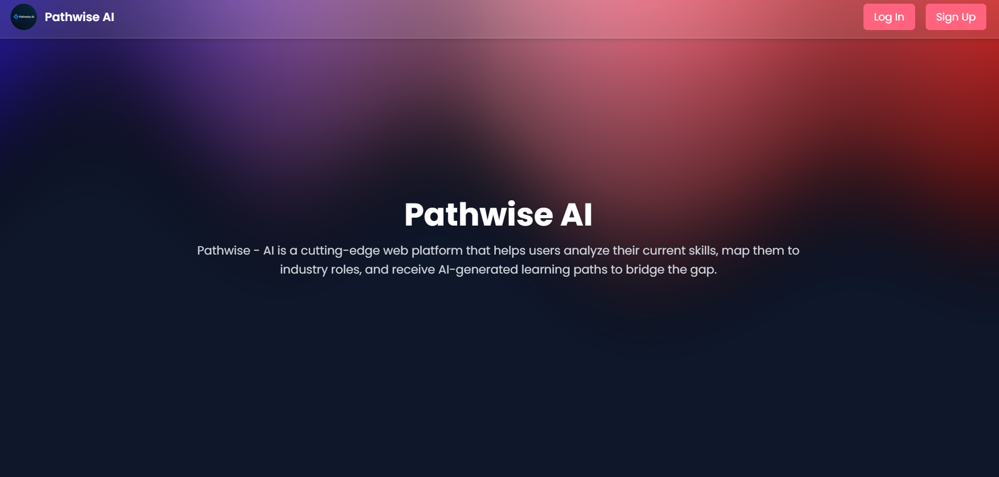

# 🚀 Pathwise-AI 
# (AI-Powered Skill Mapping & Learning Path Generator)
# (❗❗Under Making)

Pathwise - AI is a cutting-edge web platform that helps users analyze their current skills, map them to industry roles, and receive AI-generated learning paths to bridge the gap—all powered by the MERN stack.



---

## 🧠 Features

- 📝 **Smart Skill Extractor**: Parse resumes, GitHub repos, or manual input to analyze your current skills.
- 🧭 **Role Matching Engine**: Get real-time job suggestions based on your existing stack.
- 🤖 **AI Learning Path Generator**: Generate a personalized, step-by-step learning roadmap using Gemini.
- 📊 **Progress Dashboard**: Track learning goals, time estimates, and completion status.
- 👥 **Mentor Connect**: Ask questions, review code, or get guidance from experts.
- 🧩 **Modular Design**: Easily extendable architecture for adding more job roles or tech stacks.

---

## 🛠️ Tech Stack

| Layer        | Technology                                      |
|--------------|--------------------------------------------------|
| **Frontend** | React.js, TailwindCSS, Framer Motion, Recharts   |
| **Backend**  | Node.js, Express.js                              |
| **Database** | MongoDB + Mongoose                               |
| **Auth**     | JWT, Google/GitHub OAuth                         |
| **AI/NLP**   | Gemini API, LangChain, pdf-parse        |
| **Hosting**  | Vercel (frontend), Railway/Render (backend)      |
| **Bonus**    | Multer (file uploads), Socket.IO (chat)          |

---

## 📸 Screenshots

| Skill Analysis | Learning Path | Progress Tracker |
|----------------|---------------|------------------|
|  |  |  |

---

## 📦 Installation

```bash
# Clone the repo
git clone https://github.com/VishnuJha100/Pathwise-AI.git
cd Pathwise-AI

# Setup backend
cd server
npm install
npm run dev

# Setup frontend
cd ../client
npm install
npm run dev
```

🔐 Create a .env file in /server with:
```.env
PORT=8000
MONGO_URI=your_mongodb_connection_string
OPENAI_API_KEY=your_openai_key
JWT_SECRET=your_secret
```
🧪 Sample .env for Frontend
```.env
VITE_API_URL=http://localhost:8000
```

## 🧠 How It Works
- Upload resume or connect GitHub.
- Backend uses NLP to extract relevant tech skills.
- Skills matched to predefined job roles (from DB).
- AI (OpenAI/Gemini) generates a step-by-step roadmap.
- User tracks progress and connects with mentors.

## 🤝 Contributing
Want to contribute? Create a feature branch, commit your changes, and open a PR!

## 📃 License
MIT

## 🔗 Connect With Me
Made with 💙 by Vishnu Deb Jha
<br />
email: jhavishnu100@gmail.com
